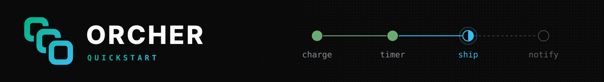

<p>
  <picture>
    <source media="(prefers-color-scheme: dark)" srcset="./assets/banner.svg">
    <source media="(prefers-color-scheme: light)" srcset="./assets/banner-light.svg">
    
  </picture>
</p>

<p align="center"><sub>Your first crash-proof workflow in five minutes, in Python, TypeScript or Rust.</sub></p>

<br />

<div>
  <a href="https://github.com/orcher-io/quickstart/actions/workflows/ci.yml"></a>
  <a href="./LICENSE"></a>
</div>

<br />

Start an ORCHER engine on your machine, run a workflow, then crash its worker halfway through and watch the workflow finish anyway.

<br />

###  What you'll build

An `order` workflow with two tasks and a durable timer between them:

```
charge ──▶ sleep 10s ──▶ ship
```

The engine records every step as it finishes, and keeps the timer itself, so
no process has to stay up while it runs. A worker that dies mid-order is
replaced by a new one, which picks the order up where it stopped: it ships
the order without charging it again.

| Directory | What's in it |
|-----------|--------------|
| [`docker-compose.yml`](docker-compose.yml) | The engine, Postgres and the schema migrations |
| [`python/`](python) | The workflow in Python, a worker and a starter |
| [`typescript/`](typescript) | The same in TypeScript |
| [`rust/`](rust) | The same in Rust |
| [`scripts/`](scripts) | The steps below as scripts, run by CI every week |

<br />

###  Prerequisites

- [Docker](https://docs.docker.com/get-docker/) with Compose v2
- For the language you pick: Python 3.11 or later, Node.js 22 or later, or stable Rust

<br />

###  1. Start the engine

```bash
git clone https://github.com/orcher-io/quickstart.git
cd quickstart
docker compose up -d --wait
```

This starts Postgres, applies the engine's schema and starts the engine, with
gRPC on `localhost:50051` and health checks on
[`localhost:8080/health/ready`](http://localhost:8080/health/ready).
Authentication is off: this engine is for your machine only.

> [!TIP]
> Port taken? Pick others, and point the examples at the new gRPC port:
>
> ```bash
> ORCHER_GRPC_PORT=50061 ORCHER_HTTP_PORT=8081 docker compose up -d --wait
> export ORCHER_URL=http://localhost:50061
> ```

<br />

###  2. Run a worker

A worker connects to the engine, registers the workflow and its tasks, and
runs them. Pick a language and leave the worker running in its own terminal.

<details>
<summary><b>Python</b></summary>

<br />

```bash
cd python
python3 -m venv .venv && source .venv/bin/activate
pip install -r requirements.txt
python worker.py
```

The workflow and its tasks, from [`worker.py`](python/worker.py):

```python
@task(name="charge")
async def charge(ctx: TaskContext, order_id: str) -> str:
    # Tasks are where side effects go: call the payment API here.
    print(f"charged {order_id}", flush=True)
    return f"charged {order_id}"


@task(name="ship")
async def ship(ctx: TaskContext, order_id: str) -> str:
    print(f"shipped {order_id}", flush=True)
    return f"shipped {order_id}"


@workflow(name="order")
async def order(ctx: WorkflowContext, order_id: str) -> str:
    charged = await ctx.execute_task(charge, order_id=order_id)
    # A durable timer: the engine keeps it, so a worker restart doesn't reset it.
    await ctx.sleep(timedelta(seconds=10))
    shipped = await ctx.execute_task(ship, order_id=order_id)
    return f"{charged}, then {shipped}"
```

</details>

<details>
<summary><b>TypeScript</b></summary>

<br />

```bash
cd typescript
npm install
npm run build
npm run worker
```

The workflow and its tasks, from [`src/worker.ts`](typescript/src/worker.ts):

```typescript
@Tasks()
export class OrderTasks {
  // Tasks are where side effects go: call the payment API here.
  @Task()
  async charge(_ctx: TaskContext, orderId: string): Promise<string> {
    console.log(`charged ${orderId}`);
    return `charged ${orderId}`;
  }

  @Task()
  async ship(_ctx: TaskContext, orderId: string): Promise<string> {
    console.log(`shipped ${orderId}`);
    return `shipped ${orderId}`;
  }
}

export const orderTasks = createTaskRefs(OrderTasks);

@Workflow({ name: 'order' })
export class Order {
  async run(ctx: WorkflowContext, orderId: string): Promise<string> {
    const charged = await ctx.executeTask(orderTasks.charge, orderId);
    // A durable timer: the engine keeps it, so a worker restart doesn't reset it.
    await ctx.sleep(Duration.fromSeconds(10));
    const shipped = await ctx.executeTask(orderTasks.ship, orderId);
    return `${charged}, then ${shipped}`;
  }
}
```

</details>

<details>
<summary><b>Rust</b></summary>

<br />

```bash
cd rust
cargo run --bin worker
```

The workflow and its tasks, from [`src/bin/worker.rs`](rust/src/bin/worker.rs):

```rust
// Tasks are where side effects go: call the payment API here.
#[task]
async fn charge(_ctx: TaskContext, order_id: String) -> Result<String> {
    println!("charged {order_id}");
    Ok(format!("charged {order_id}"))
}

#[task]
async fn ship(_ctx: TaskContext, order_id: String) -> Result<String> {
    println!("shipped {order_id}");
    Ok(format!("shipped {order_id}"))
}

#[workflow(name = "order")]
async fn order(ctx: WorkflowContext, order_id: String) -> Result<String> {
    let charged: String = ctx.execute_task(charge, order_id.clone()).await?;
    // A durable timer: the engine keeps it, so a worker restart doesn't reset it.
    ctx.sleep(Duration::from_secs(10)).await?;
    let shipped: String = ctx.execute_task(ship, order_id).await?;
    Ok(format!("{charged}, then {shipped}"))
}
```

</details>

<br />

###  3. Start a workflow

In a second terminal, in the same directory, start an order and wait for it:

```bash
python start.py                # Python
npm run start-workflow         # TypeScript
cargo run --bin start          # Rust
```

The worker prints `charged order-…`, then `shipped order-…` ten seconds later,
and the starter prints the workflow's result:

```
started workflow order-3f9c1a7e
result: charged order-3f9c1a7e, then shipped order-3f9c1a7e
```

<br />

###  4. Kill the worker mid-run and watch it resume

1. Start another order, as in step 3.
2. When the worker prints `charged order-…`, the workflow is sleeping. Stop the
   worker with <kbd>Ctrl</kbd>+<kbd>C</kbd>, or kill it outright.
3. The starter keeps waiting: the order is safe in the engine, not in the
   worker. Start the worker again, as in step 2.
4. The new worker prints `shipped order-…` once the ten seconds are up, and the
   starter prints the result. It never prints `charged` again: the charge
   already happened, so the workflow resumes after it.

[`scripts/kill-and-resume.sh`](scripts/kill-and-resume.sh) does the same with
`kill -9`, and fails unless the order was charged exactly once and shipped by
the second worker:

```bash
scripts/kill-and-resume.sh python    # or typescript, or rust
```

It runs the examples from their directories, so install them first, as in
step 2 (for Rust, `cargo build --bins`; for Python, set `PYTHON` to your
virtualenv's interpreter if it isn't active).

When you're done, `docker compose down -v` stops the engine and deletes its
data.

<br />

###  Next steps

Each SDK's README covers retries, events, child workflows, actors and testing:

| Language | SDK | Package |
|----------|-----|---------|
| Python | [orcher-io/sdk-py](https://github.com/orcher-io/sdk-py) | [`orcher-sdk` on PyPI](https://pypi.org/project/orcher-sdk/) |
| TypeScript | [orcher-io/sdk-ts](https://github.com/orcher-io/sdk-ts) | [`@orcher/sdk` on npm](https://www.npmjs.com/package/@orcher/sdk) |
| Rust | [orcher-io/sdk-rust](https://github.com/orcher-io/sdk-rust) | [`orcher-sdk` on crates.io](https://crates.io/crates/orcher-sdk) |

<br />

###  The engine image

[`ghcr.io/orcher-io/orcher`](https://github.com/orgs/orcher-io/packages/container/package/orcher)
is a free developer preview. It is free to use for development and
evaluation; production use requires permission. The image has its own
license, separate from this repository's; its terms are on the
[image's package page](https://github.com/orgs/orcher-io/packages/container/package/orcher).

To try another engine version, set `ORCHER_IMAGE`, for example
`ORCHER_IMAGE=ghcr.io/orcher-io/orcher:<version> docker compose up -d --wait`.

###  License

The code in this repository is licensed under the
[Apache License, Version 2.0](LICENSE). The engine image is not covered by it:
it has its own license, described above.
